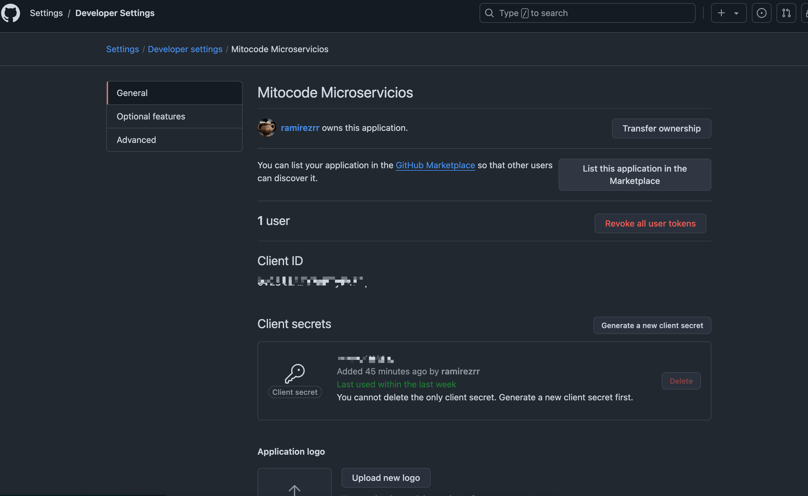
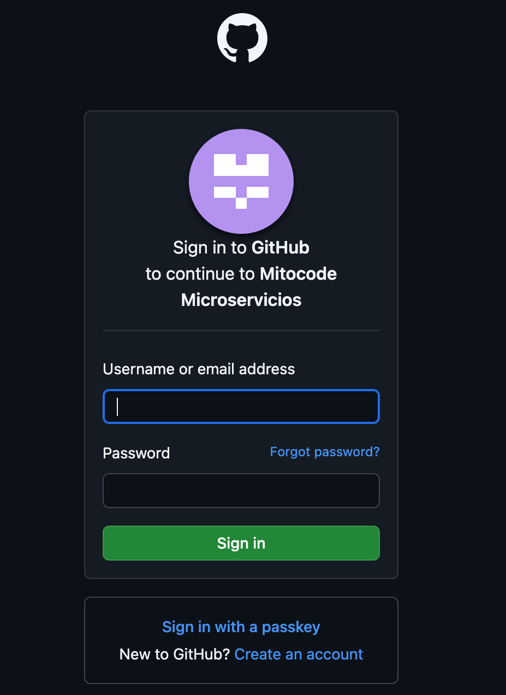

# Gestión-Licencia API


### OPEN API:
```shell 
# Url que cargará las propiedades de licencia
curl http://localhost:9010/gestor-licencias-api/api-docs
```
```http request
http://localhost:9010/gestor-licencias-api/swagger-ui/index.html#/Licencias/listLicenses
```


----
### Spring security OAUTH 2
Este proyecto implementa la seguridad básica con GITHUB para proteger las rutas de la aplicación. Utiliza la autenticación básica y permite el inicio de sesión a través de un formulario. 


